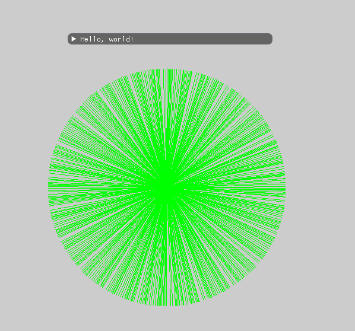
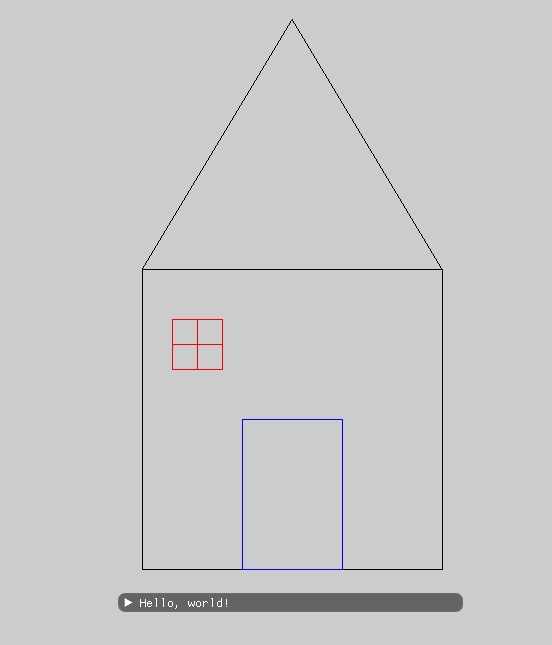

# Assignment1Report  

## algorithm implementation
    void Renderer::DrawLine(const glm::ivec2& p1, const glm::ivec2& p2, const glm::vec3& color)
	{
		// TODO: Implement bresenham algorithm
		// https://en.wikipedia.org/wiki/Bresenham%27s_line_algorithm
		int x1 ;
		int y1 ;
		int x2 ;
		int y2 ;

		if (p1.x < p2.x) {                 //determining first and second point
			 x1 = p1.x;
			 y1 = p1.y;
			 x2 = p2.x;
			 y2 = p2.y;
		}
		else {
			x2 = p1.x;
			y2 = p1.y;
			x1 = p2.x;
			y1 = p2.y;
		}

		if (x1 == x2) {                         /// virtical line
			int y = y1 > y2 ? y2:y1;
			int ymax = y1 > y2 ? y1 : y1;
			for (y; y <= ymax; y++) {
				PutPixel(x1,y, color);
			}
			return;
	        }

		float a = float(y1 - y2) / float(x1 - x2);
		int x = x1;
		int	y=y1;
		float c = y1 - a * x1;

		if (a<=1 && a>=0) {                    ////// 1=>a>0
			float e = 2*(a*x+c-y)-1;
			while (x <= x2) {
				if (e > 0) {
					y++;
					e-=2;
				}
				PutPixel(x,y,color);
				x++;
				e += 2 * a;
			}
			return;
		}

		if (a < 0 && a >= -1) {
			 x = x1;
			 y = y1;
			float e = 2*(y-(a*x+c)) - 1 ;

			while (x <= x2) {
				if (e > 0) {
					y--;
					e-=2;
				}
				PutPixel(x, y, color);
				x++;
				e -= 2*a;
			}
			return;
		}
	
		if (a > 1) {
			float e =  2*(((y - c) / a) - x) - 1 ;
			while (y <= y2) {
				if (e > 0) {
					x++;
					e-=2;
				}
				PutPixel(x, y, color);
				y++;
				e += 2 / a;
			}
			return;
		}

		if (a < -1) {	
			float e = 2*(((y - c) /a) - x) - 1;
			while (y >= y2) {
				if (e > 0) {
					x++;
					e-=2;
				}
				PutPixel(x, y, color);
				y--;
				e -= 2 / a;
			}
			return;
		}
	
	}

## Sanity check

## drawing

