# Assignment1 Report - Part 2:
## Loading Mesh Models
The console output when loading "demo.obj" is shown below.

       ------- Vertices -------(14)
          x         y         z

          0         0         0
          2         0         0
          2         2         0
          0         2         0
          0         0        -2
          2         0        -2
          2         2        -2
          0         2        -2
       -0.6         1        -1
          1      -0.6        -1
        2.6         1        -1
          1       2.6        -1
          1         1       0.6
          1         1      -2.6

       ------- Faces -------(24)

       v1: 1, vn1: 1 ,vt1: 0           v2: 13, vn2: 2 ,vt2: 0          v3: 4, vn3: 1 ,vt3: 0
       v1: 4, vn1: 3 ,vt1: 0           v2: 13, vn2: 4 ,vt2: 0          v3: 3, vn3: 3 ,vt3: 0
       v1: 3, vn1: 5 ,vt1: 0           v2: 13, vn2: 6 ,vt2: 0          v3: 2, vn3: 5 ,vt3: 0
       v1: 2, vn1: 7 ,vt1: 0           v2: 13, vn2: 8 ,vt2: 0          v3: 1, vn3: 7 ,vt3: 0
       v1: 4, vn1: 1 ,vt1: 0           v2: 9, vn2: 9 ,vt2: 0           v3: 1, vn3: 1 ,vt3: 0
       v1: 8, vn1: 10 ,vt1: 0          v2: 9, vn2: 11 ,vt2: 0          v3: 4, vn3: 10 ,vt3: 0
       v1: 5, vn1: 12 ,vt1: 0          v2: 9, vn2: 13 ,vt2: 0          v3: 8, vn3: 12 ,vt3: 0
       v1: 1, vn1: 14 ,vt1: 0          v2: 9, vn2: 15 ,vt2: 0          v3: 5, vn3: 14 ,vt3: 0
       v1: 5, vn1: 16 ,vt1: 0          v2: 14, vn2: 17 ,vt2: 0         v3: 6, vn3: 16 ,vt3: 0
       v1: 8, vn1: 12 ,vt1: 0          v2: 14, vn2: 18 ,vt2: 0         v3: 5, vn3: 12 ,vt3: 0
       v1: 7, vn1: 19 ,vt1: 0          v2: 14, vn2: 20 ,vt2: 0         v3: 8, vn3: 19 ,vt3: 0
       v1: 6, vn1: 21 ,vt1: 0          v2: 14, vn2: 22 ,vt2: 0         v3: 7, vn3: 21 ,vt3: 0
       v1: 3, vn1: 23 ,vt1: 0          v2: 11, vn2: 24 ,vt2: 0         v3: 7, vn3: 23 ,vt3: 0
       v1: 2, vn1: 5 ,vt1: 0           v2: 11, vn2: 25 ,vt2: 0         v3: 3, vn3: 5 ,vt3: 0
       v1: 6, vn1: 26 ,vt1: 0          v2: 11, vn2: 27 ,vt2: 0         v3: 2, vn3: 26 ,vt3: 0
       v1: 7, vn1: 21 ,vt1: 0          v2: 11, vn2: 28 ,vt2: 0         v3: 6, vn3: 21 ,vt3: 0
       v1: 3, vn1: 3 ,vt1: 0           v2: 12, vn2: 29 ,vt2: 0         v3: 4, vn3: 3 ,vt3: 0
       v1: 4, vn1: 10 ,vt1: 0          v2: 12, vn2: 30 ,vt2: 0         v3: 8, vn3: 10 ,vt3: 0
       v1: 8, vn1: 19 ,vt1: 0          v2: 12, vn2: 31 ,vt2: 0         v3: 7, vn3: 19 ,vt3: 0
       v1: 7, vn1: 23 ,vt1: 0          v2: 12, vn2: 32 ,vt2: 0         v3: 3, vn3: 23 ,vt3: 0
       v1: 1, vn1: 7 ,vt1: 0           v2: 10, vn2: 33 ,vt2: 0         v3: 2, vn3: 7 ,vt3: 0
       v1: 2, vn1: 26 ,vt1: 0          v2: 10, vn2: 34 ,vt2: 0         v3: 6, vn3: 26 ,vt3: 0
       v1: 6, vn1: 16 ,vt1: 0          v2: 10, vn2: 35 ,vt2: 0         v3: 5, vn3: 16 ,vt3: 0
       v1: 5, vn1: 14 ,vt1: 0          v2: 10, vn2: 36 ,vt2: 0         v3: 1, vn3: 14 ,vt3: 0

## Loading Mesh Models
First to see the object we want to scale it to a reasonable size and then translate it to make the whole object appear in the view:
* Among the model vertices, I found the min and max values of x, y, and z.
* Next, I divided 400.0 by the distance from (min.x, min.y) to (max.x, max.y). Using this value, we can scale the model to a reasonable size.
* Then i translate the object by 0-min.x and 0-0-max.x for x and y axis accordingly so that the minpoint will start at (0,0).
* The translation and scaling matrices I came up with are below:
#### Scale matrix:
         float distance = getDistance(minx, miny, max_x, max_y);
         float diffsize = scale_value / distance;
            glm::mat4 scale = glm::mat4(
		                                 diffsize, 0, 0, 0,
		                                  0, diffsize, 0, 0,
	                                      0, 0, diffsize, 0,
		                                  0, 0, 0, 1);

#### Translate matrix:
        glm::mat4 translate = glm::mat4(
		                                1, 0, 0, diffx,
		                                0, 1, 0, diffy,
		                                0, 0, 1, diffz,
		                                0, 0, 0, 1);

* By multiplying the above translation and scaling matrices, and applying the received transformation matrix to the vertices, the model is transformed to be placed at (0,0) and fit the screen.\
Below is the code for the FitToScreen() function, described above.
#### FitToScreen:
        void MeshModel::FitToScreen(){
	        int scale_value = 400;
	        float minx = getMinX(vertices);
	        float miny = getMinY(vertices);
	        float minz = getMinZ(vertices);
	        float max_z = getMaxZ(vertices);
	        float max_x = getMaxX(vertices);
	        float max_y = getMaxY(vertices);
    
	        float distance = getDistance(minx, miny, max_x, max_y);
	        float diffsize = scale_value / distance;

	        glm::mat4 scale = glm::mat4(
		                                diffsize, 0, 0, 0,
		                                0, diffsize, 0, 0,
	                                    0, 0, diffsize, 0,
		                                0, 0, 0, 1);

	        ApplyTransformationToVertices(scale);

	        minx = getMinX(vertices);
	        miny = getMinY(vertices);
	        float x_start_point = 0;
	        float y_start_point = 0;
	        float z_start_point = 0;
	        float diffx = x_start_point - minx;
	        float diffy = y_start_point - miny;
	        float diffz = z_start_point - minz;

	        glm::mat4 translate = glm::mat4(
		                                    1, 0, 0, diffx,
		                                    0, 1, 0, diffy,
		                                    0, 0, 1, diffz,
		                                    0, 0, 0, 1);

	        ApplyTransformationToVertices(translate);   
        }

## Drawing Models
I was able to display loaded models on the screen by ignoring the z coordinate. Following are some screenshots.
### bishop
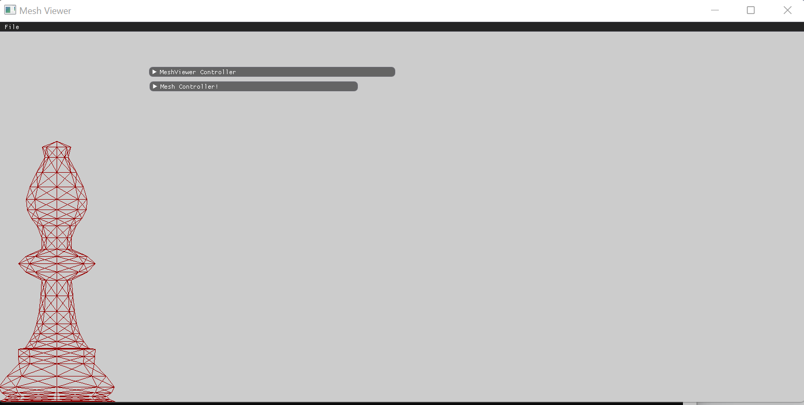
### Cow
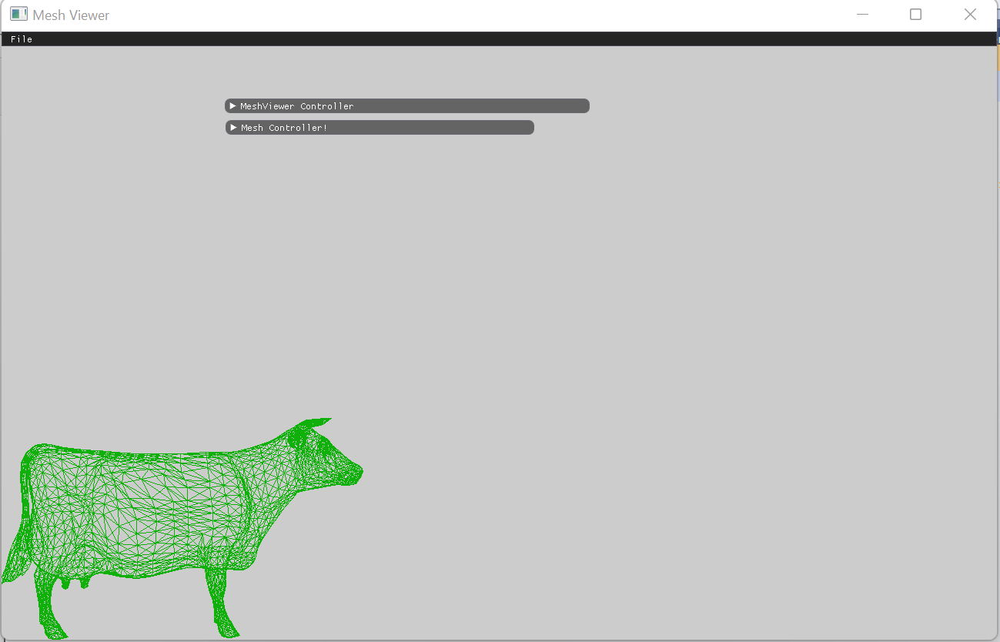
### blob
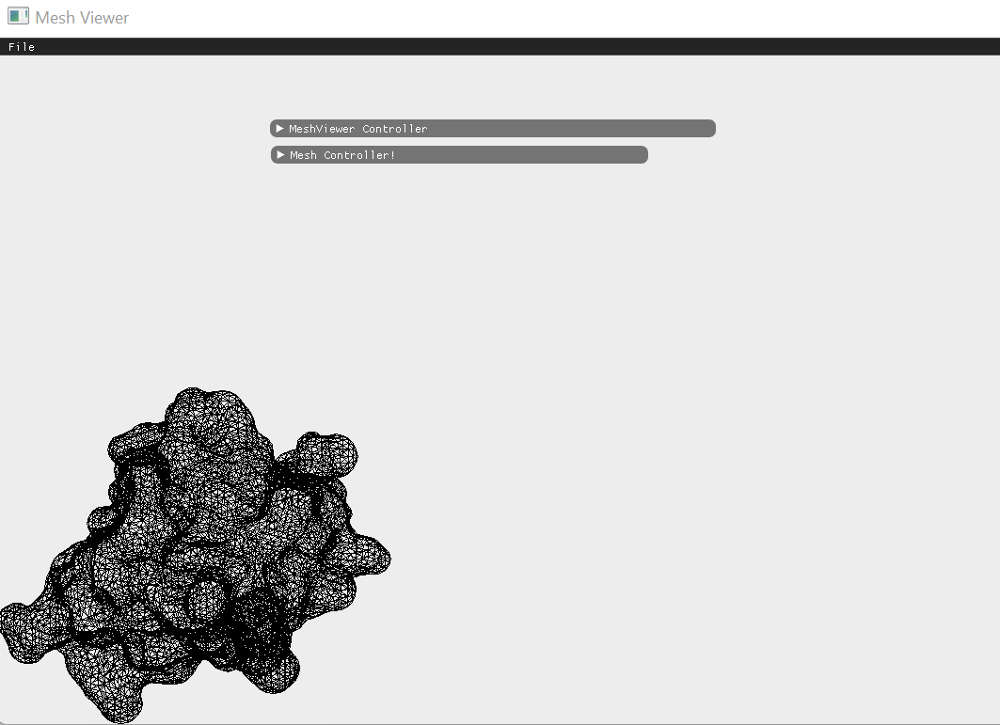

## GUI Items
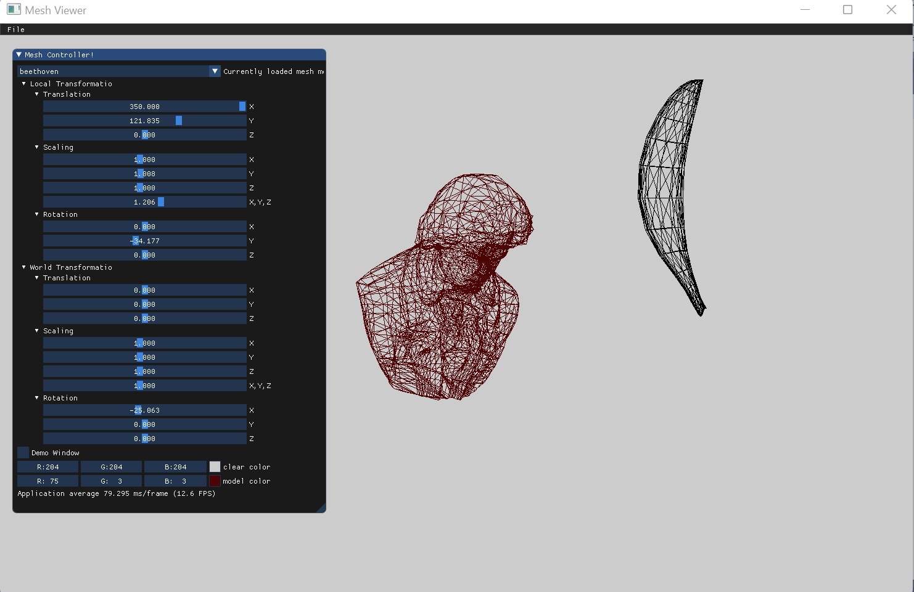

Above is an image of the GUI I designed.
* In the image, you can see the "Mesh Controller" window includes a comboBox which present loaded models so that i can choose one to modify.
* The collapsible header of the active model contains sliders for modifying transformations.
* Also i added color picker for the background and for the model to have the flexibility to play with the colors.

I computed the transformation matrix according to all the 10 transformation matrices(5 for each frame):\
    transformation matrix = world_scale_matrix * world_z_axis_rotate_matrix * world_y_axis_rotate_matrix * world_x_axis_rotate_matrix * world_translate_matrix * local_scale_matrix * local_z_axis_rotate_matrix * local_y_axis_rotate_matrix * local_x_axis_rotate_matrix * local_translate_matrix .

# Model vs. World Transformation
Presented below are two screenshots comparing model and world transformations.\
Translating in the model frame, then rotating in the world frame:
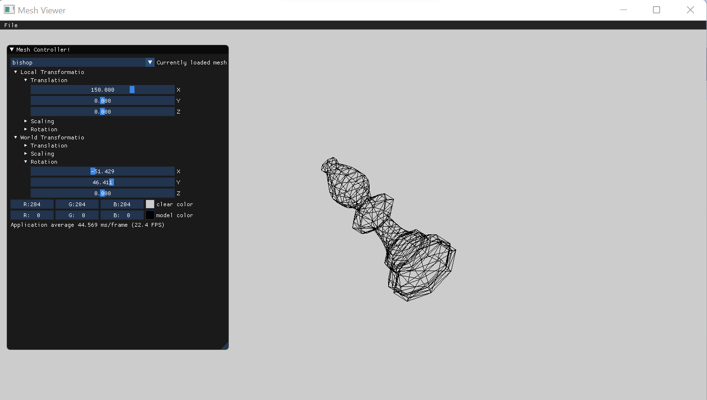
Translating in the world frame, then rotating in the local frame:
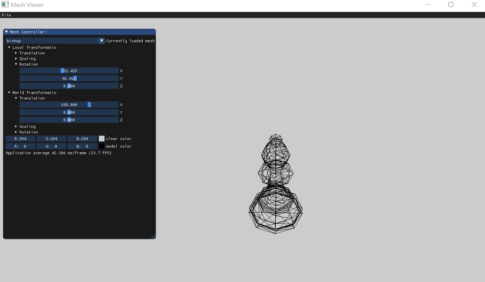

## Demonstrations
### Translation  
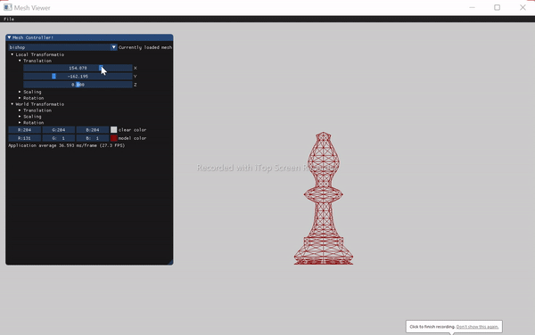
### Scaling
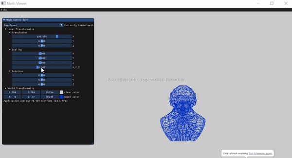
### Rotation about the x-axis
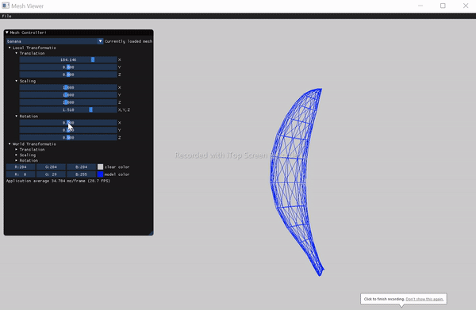
### Rotation about the y-axis
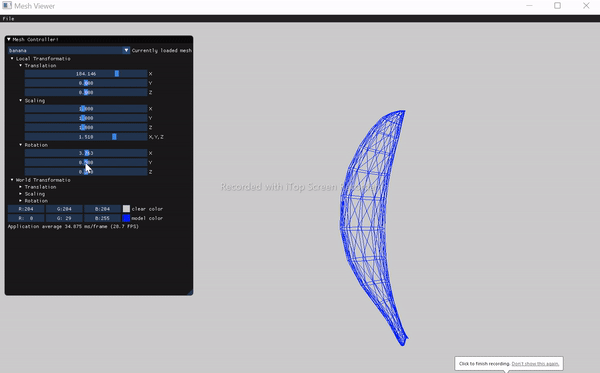
### Rotation about the z-axis
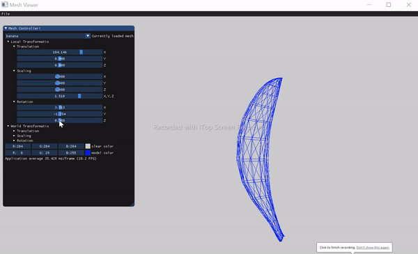

