# Assignment1 Report - Part 3:
## 1.Implementing a camera with orthographic projection
I romved the centering trick from the last assignement, and to let the model appear at the middle of the scene I mapped the mesh model point
that I get after doing the transformation from the canonical view volume using the following steps:\
point.x = (point.x + 1) * half_width \
point.y = (point.y + 1) * half_height 
### The following screenshots compare different view volumes.
Camara parameters:\
left = -640 \
right = 640 \
bottom = -360 \
top = 360 
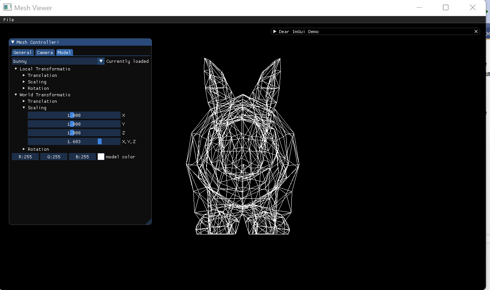
Camara parameters:\
left = -400\
right = 400\
bottom = -850\
top = 850\
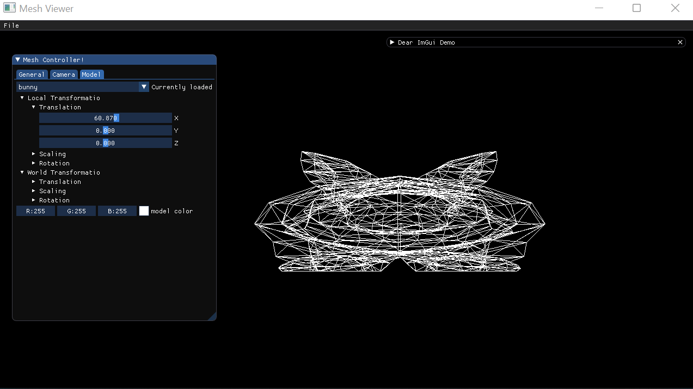
#### I added the ability to change the up, down, left, right in the UI. In the orthographic projection.
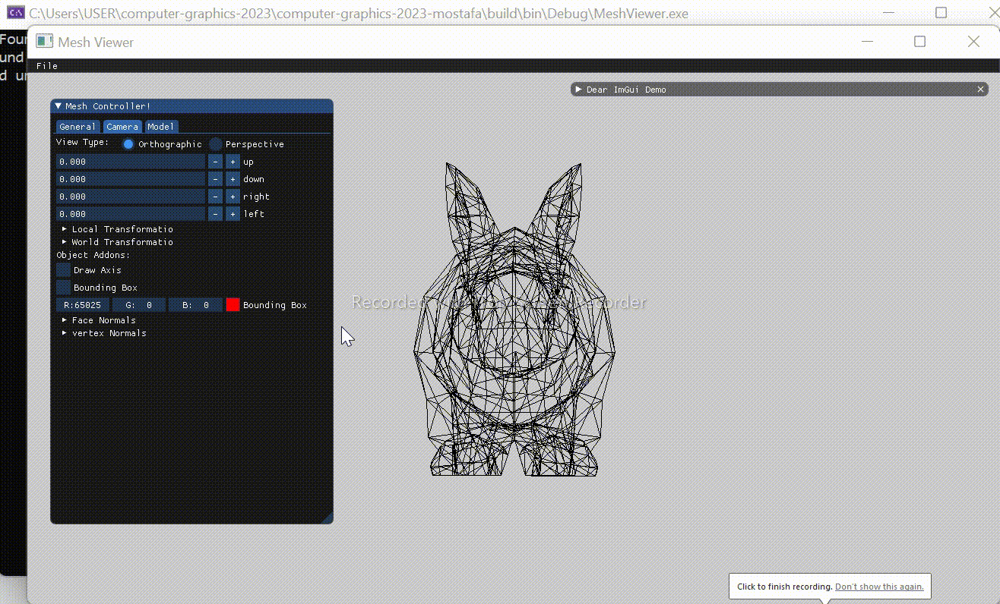
## 2.Reposition the camera  using incremental change
I implemented the incremental function inc_func, it works by pressing the '+' , '-' buttons in the camera settings .
I calculated the inverse matrix of the transformaion and  multiply it with the inverse of the previous transformations.\
the multiplication order:\
inverse(previous transformations)*inverse (transformaion).\

## 3.Setting the View Volume Automatically
The next step was to implement a feature for automatically setting the view volume, based on the window size.
As my implementation maintains the aspect ratio of the original model, I verified the results with the following aspect ratios:
* A window with a larger width than height.
* A window with a larger height than width.
* A window with a width equal to its height.
#### A gif is shown below:
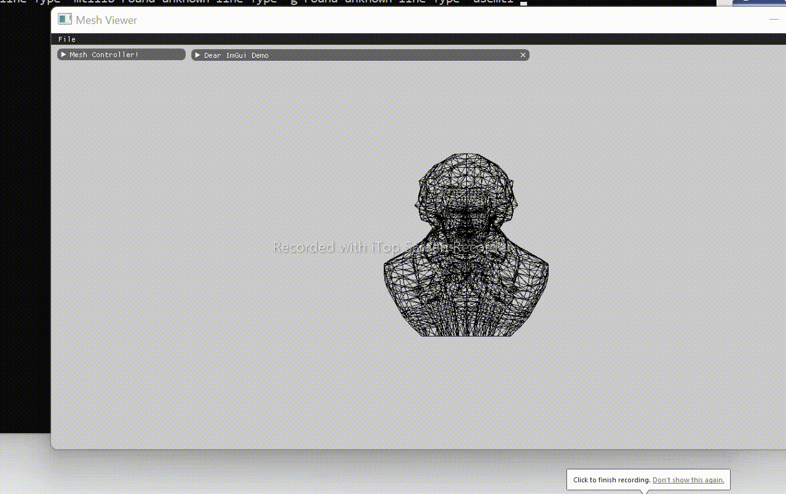
## 4.Axes Feature
My next step was to implement a feature to draw the model and world axes. The following gifs show how model and world transformations affect them.
The red, green, and cyan axes represent the model axes, and the blue, purple, and green axes represent the world axes.
### Translation in World and Local Axes
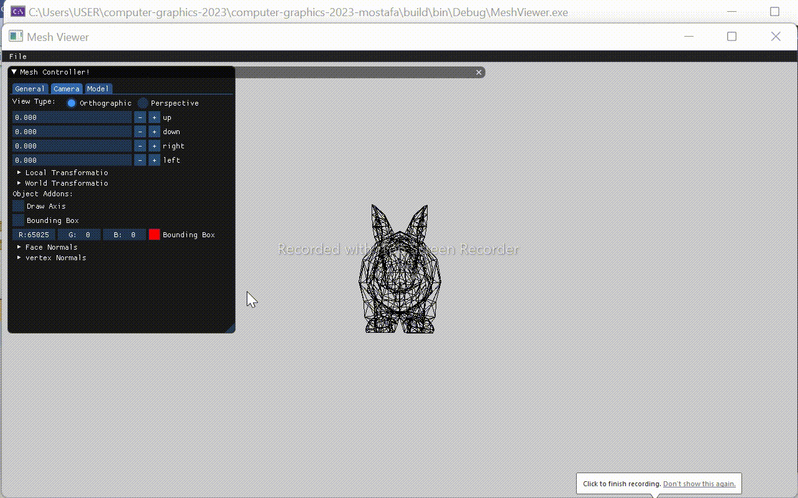
### Rotation in World and Local Axes
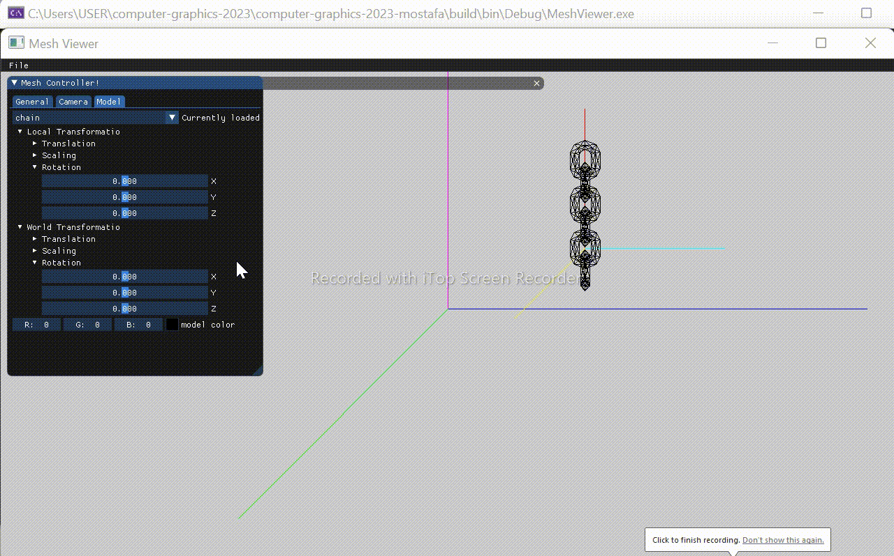
## 5.Model VS. World Frame Transformations 
To illustrate the difference between model and world frame transformations, I have chosen the following non-commuting transformations:
* T1: Rotate 60 degrees around the x-axis, and then 90 degrees around the z-axis.
* T2: Rotate 45 degrees around the y-axis.\
The following screenshots show my results.
### T1 in model frame T2 in world frame
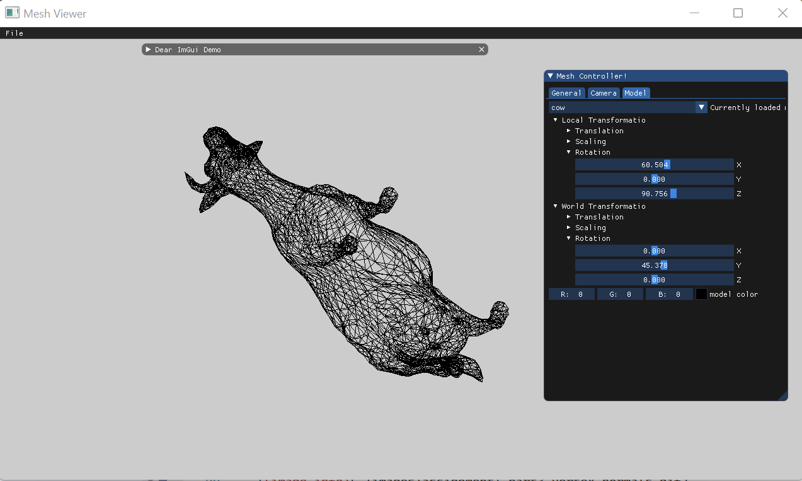
### T2 in model frame T1 in world frame
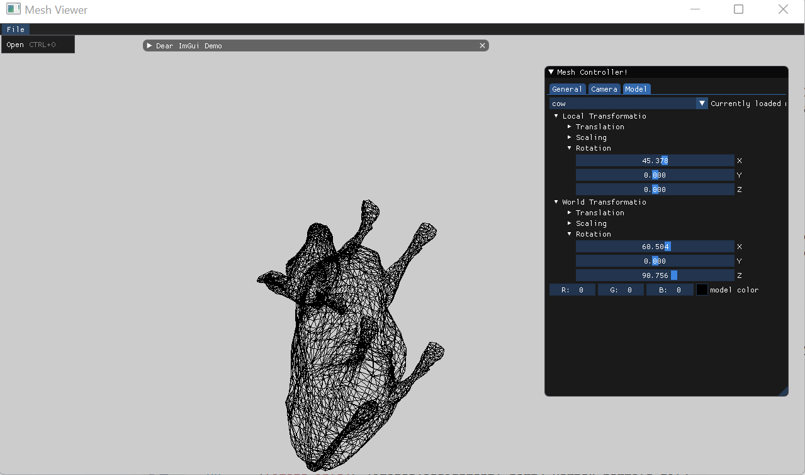
## 6,7 Bounding Box and Normals
I found the max and min values for each axes in the loaded mesh model vertices list then made 8 (box vertices) then I multiplied them by the camera transform and the model transform then I used the DrawLine method to connect the 8 points and make the boundingBox\
As a sanity check for my implementation of bounding box, face normals, and vertex normals, I performed the following transformations on a model:
* Translate all axes.
* Scale all axes.
* Rotate around the x-axis.
* Rotate around the y-axis.
* Rotate around the z-axis.
As the bounding box and normals transformed with the model, I deduced that my implementation is correct.
### Bounding Box Rotation and translation
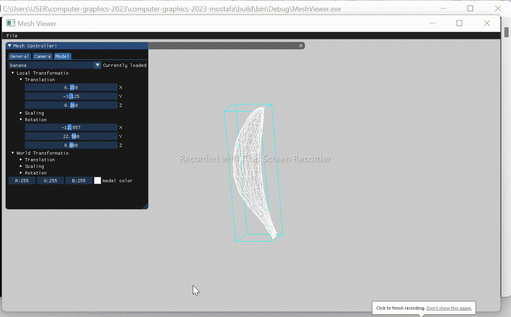
### Bounding Box scaling
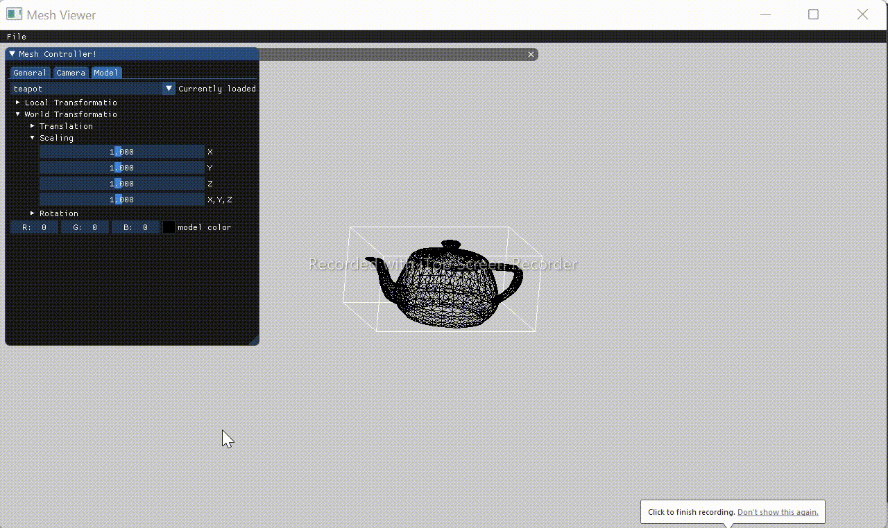
### Face Normals

### Vertex Normals

## 8.Difference Between perspective projection and orthographic projection
we can notice in the gifs that if we make the camera move closer the objects get bigger, and if we make it move away the objects look smaller, on the other hand the distance of the camera in the orthographic view doesn't change the object size
and We can clearly see that in the perspective projection, the object gets closer to the camera as we translate to the positive z axis.\
Here are some gifs to illustrate the difference between orthographic and perspective projection.
### Camera with Orthographic Projection
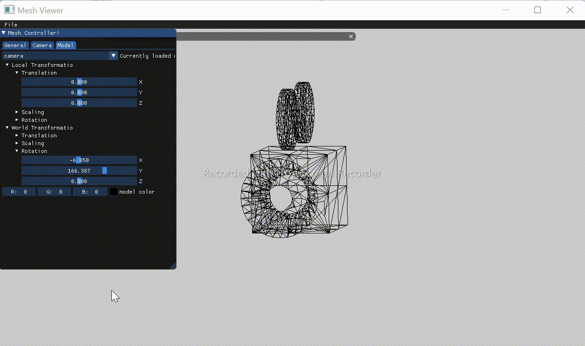
### Camera with Perspective Projection
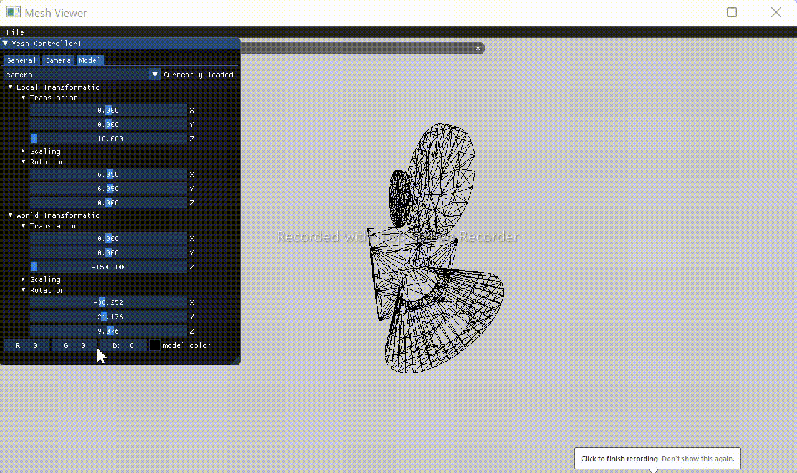
### Tea-Pot with Orthographic Projection
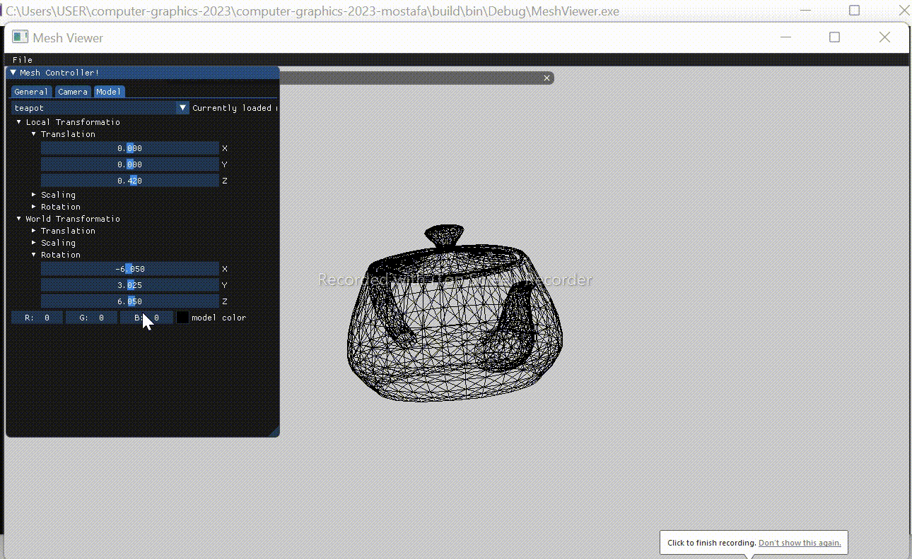
### Tea-Pot with Perspective Projection

