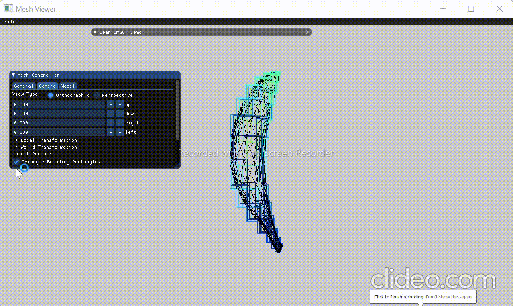
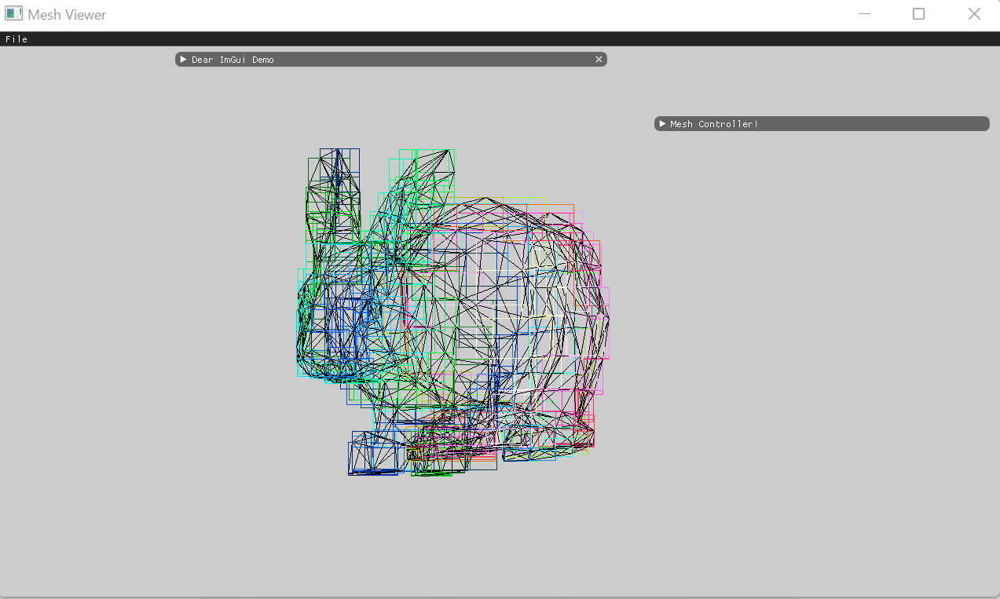
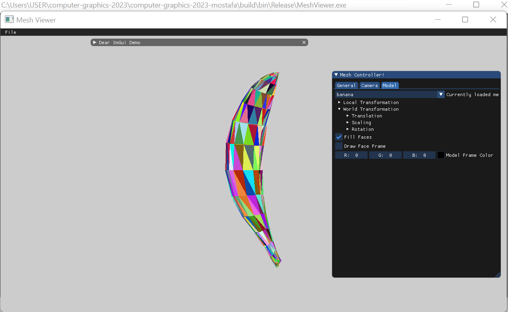
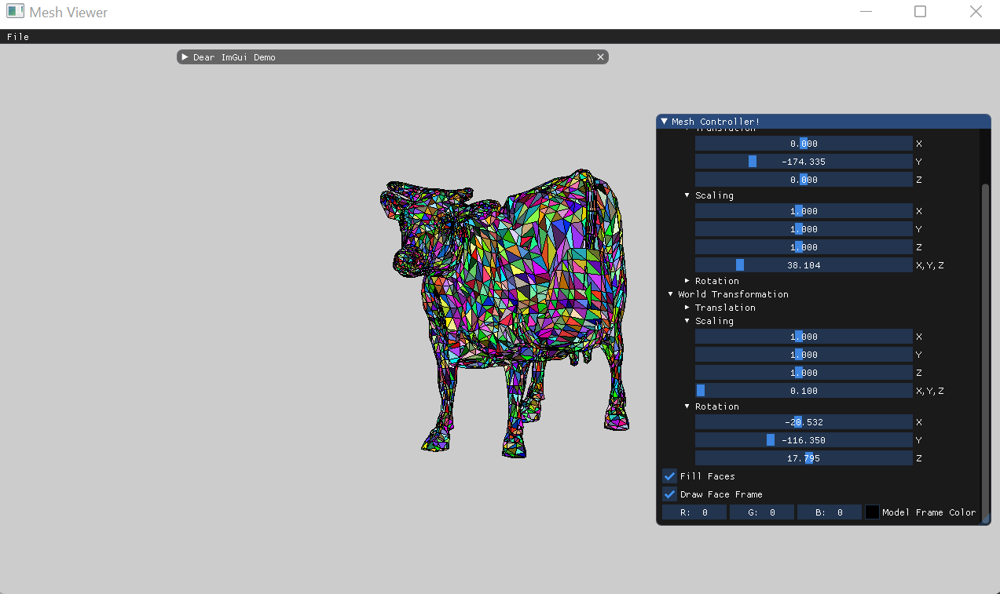
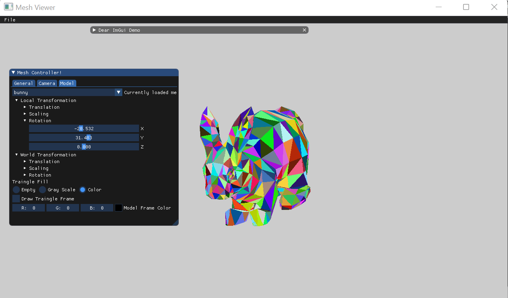
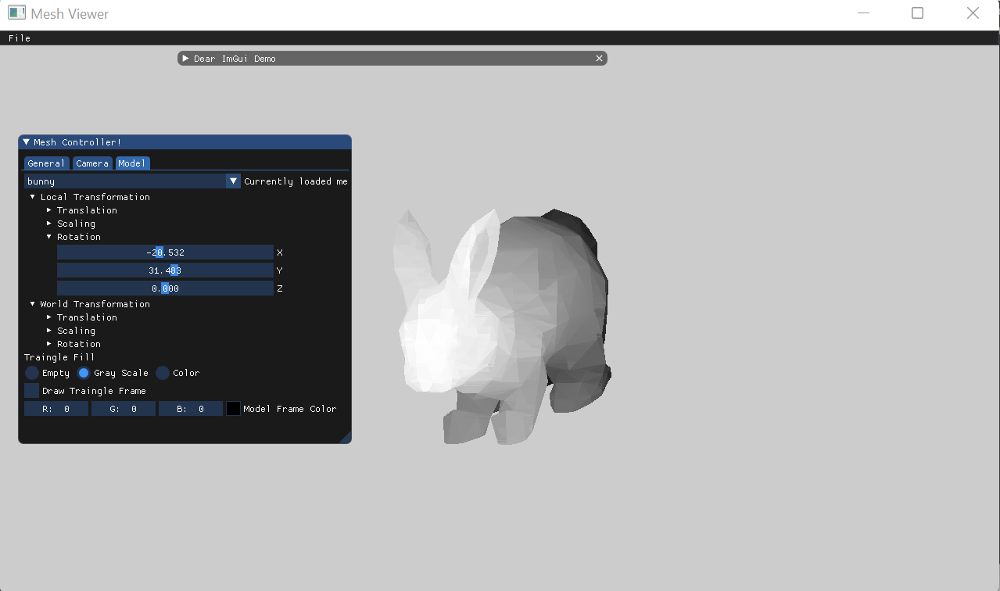
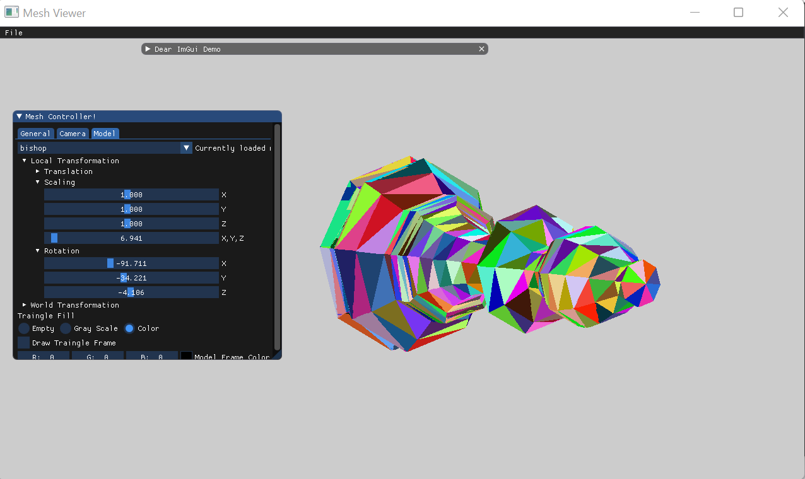
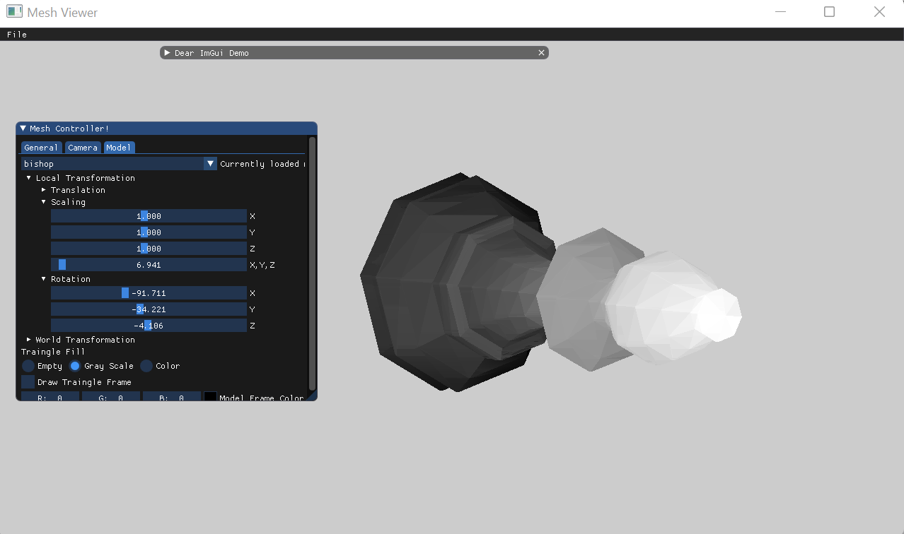

# Assignment2 Report - Part 1:
## 1.Drawing Bounding Rectangles.
I began by implementing a feature to draw the bounding rectangle for each triangle in a different color.
The feature can be toggled on and off.
to make the color of the rectangle related to the depth of triangle i used the following equation:
```
auto R = depth * (255 / max_depth)
auto G =  128+127 * sin(depth * M_PI / max_depth)
auto B =  128+128 * sin(depth * M_PI / max_depth + M_PI / 2)
bounding_color = glm::vec3(R,G,B)
```
as you can see in the following gif the color changes as the depth of the triangles changes:


## 2.creating a 2D boolean buffer for each face bounding triangle.
I created a hashtable  with [i,j] (indexes) as a key instead of a 2d array. then  for all the points in the face edges
i added them to the hashtable so  that i can check them in the face filling method. after that for each row in
the bounding rectangle i found the first point of the face by checking the hashtable then found the last point of face in the same way and then i drawed
a line between them,every face is filled with a random color which was randomely generated in the model class constructor. the code of the scanline algorithm is shown bellow:
```
if (fill)
  for (int i = max_y; i >= min_y; i--)            //start from the top 
    for (int j = min_x; j <= max_x; j++)         
	  if (buffer[{i,j}])                          // if the point [i,j] is the first face point in the  row 
	    for (int k = max_x; k >= j; k--)          //find the last point that exists in the hashtable in the same row
		  if (buffer[{k,i}])               
		    DrawLine(glm::vec2(j, i), glm::vec2(k, i), faceColor)
			break                                 // go to the next row
	
```

## 3.Filling Triangles
as i explained in the previous section i implemented the scanline algorithm,also i added the ability to add and remove the lines between the faces also to add and remove the filling of the faces with a checkbox:
### as you can see tea-pot triangles are overlapping cause i still didnt implement the z-buffer algorithm.




# 4.The Z-Buffer Algorithm
In order to overcome triangles overlapping, I implemented the z-buffer algorithm.\
as you can see in the following gif  there is no  triangles overlapping in the tea-pot.

### The following screenshots compare the color buffer and z-buffer.






	