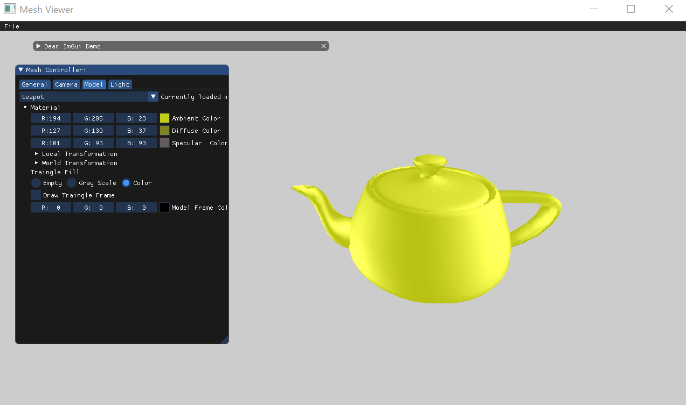
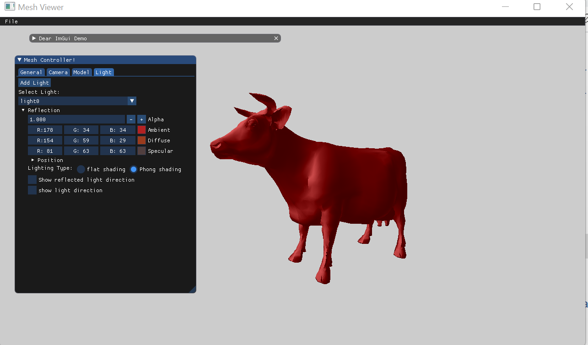
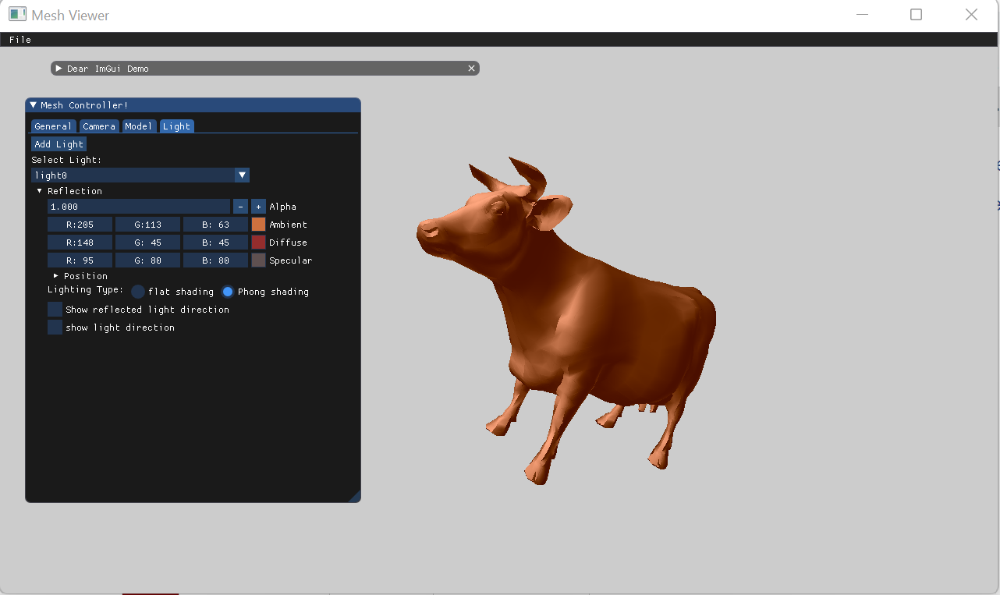
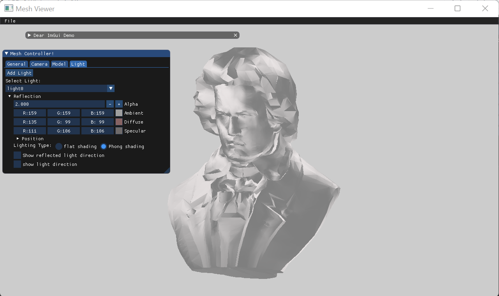

# Assignment2 Report - Part 2:
## 1.Ambient Lighting
First, I started making a new class for the light source. I added 3 RGB values For each one of diffuse,ambient and specular lights.
I also added 3 RGB values to the mesh model as these represent the material of the object.\
I used the formula that we saw at the lecture to calculate the ambient light:
```
auto la = scene.GetActiveLight().ambient;
auto ka = model.getAmbient();
auto Ia = glm::vec3(la.x * ka.x, la.y * ka.y, la.z * ka.z);
```
### First Example
Illuminating with a white ambient light, on a blue ambient teapot, resulted in a blue teapot.
As discussed in class, the ambient lighting is computed by multiplying the material's ambient with the light's ambient.
Since the ambient of the teapot is blue and the ambient of the light is white, which is a 3d vector of 1's, the ambient lighting is similar to the ambient component of the teapot.

On the other hand, illumanting with a red ambient light on the same teapot, resulted in a black teapot.
The light's ambient red coordinate is the only non-zero coordinate, while the teapot's ambient red coordinate is the only zero coordinate.
Multiplying these two vectors, results in a 3d vector of zeroes, which is black in color.


### Second Example
As can be seen in the screenshot below, I changed the ambient lighting of a banana to a yellow shade, which has a non-zero value for the red, green, and blue coordinates.

Since all of the banana's ambient coordinates have a non-zero value, illuminating it with a red ambient light resulted in a red shaded banana.

Illuminating with a green ambient light, resulted in a green shaded banana.

And illuminating with a blue ambient light resulted in a blue shaded banana.

## 2.Diffuse Lighting
I calculated the diffuse light according to the formula we saw at the lecture:
```
auto ld = scene.GetActiveLight().diffuse
auto kd = model.getDiffuse()
auto light_position = scene.GetActiveLight().GetPosition()
auto angle= getAngle(normal, light_position)
auto Id= glm::vec3(angle*kd.x * ld.x,angle* kd.y * ld.y, angle*kd.z * ld.z)
```
Following are screenshots of the scene displayed in the "Ambient Lighting" examples, with a white ambient and diffuse light.


#### Tea-pot with red ambient,diffuse material and white  ambient,diffuse lighting.


## 4.Reflection Vector
for each face I calculated the reflected vector using this formula:
```
r = 2 * n * glm::dot(n, l) - l
```
and then  draw it in cyan , for light ray direction I used the l vector direction light (lightlocation-point) then draw it in green.
Below are screenshots of the direction of light and reflected light for different light positions.
### Light Position 0x0

### Light Position 0x1000

### Light Position 1000x1000

## 5.PhongShading with specular light
I calculated the specular light according to the formula we saw in the lecture:
```
r = 2 * n * glm::dot(n, l) - l
v = current_model.getCameraEyeVector()
Is= Ks * glm::dot(r,v) * ls
```
The screenshots below illustrate phong shading with and without shininess for specular lighting.



## 6.Demonstrations
### Rabbit 


### Cow
#### flat shading

#### phong shading





### Chain

### Banana


### Beethoven
#### flat shading

#### phong shading



