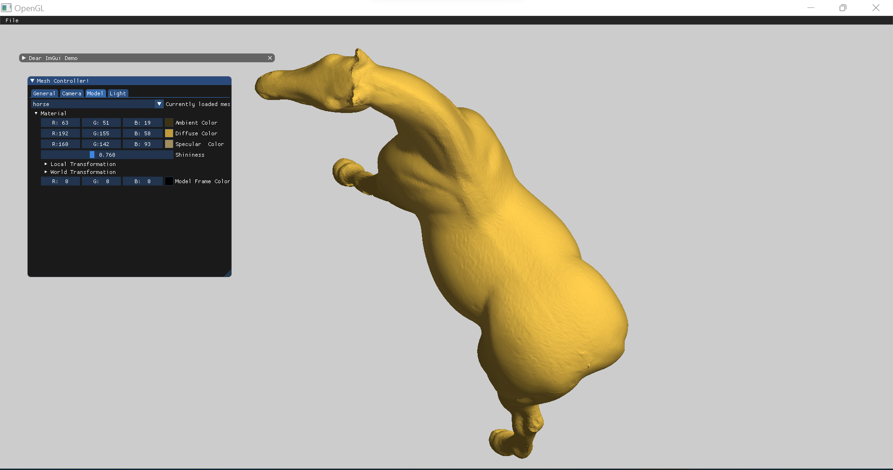
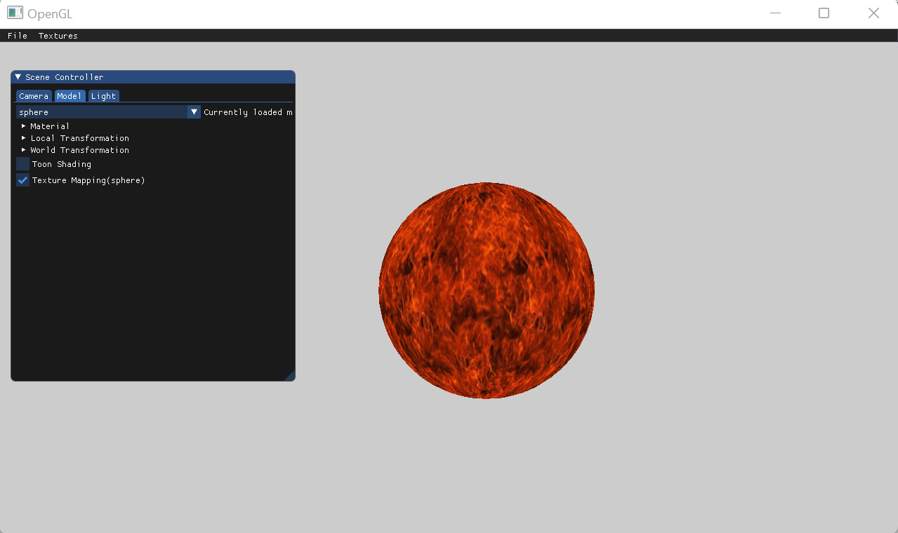

# Assignment 3 Report:
In this assignment, I will replace the software renderer implemented in the previous assignments with an OpenGL renderer.

## 1.Renderer::InitOpenGLRendering() - Explained
1. Unique identifiers are created for an OpenGL texture and a VAO, and respectively stored in gl_screen_tex and gl_screen_vtc.
2. gl_screen_vtc is set to be the current vertex array.
3. A unique buffer identifier is created and stored in buffer.
4. buffer is set to be the current buffer.
5. The GLFloat's vtc and tex are copied to the GPU.
6. A vertex shader (vshader.glsl) and fragment shader (fshader.glsl) are loaded and compiled and then made the current program.
7. Two attributes are defined for the vertex shader: vPosition (vertex position data) and vTexCoord (texture position data).
8. GL_TEXTURE0 is used as the texture id for a uniform variable texture

## 2.Updating the MeshModel Class
I added the vbo and vao to the MeshModel attributes at the time of cunstructing the MeshModel object I generated the vao so its can point to the vbo then binded it and figure it so OpenGL can know how to bind it then I creates a buffer and I giving it the reference for vbo then I bind the  vbo and later I stored the vertices to it(vbo). and in the renderer class I used glDrawArrays to draw triangles.
```
modelVertices.reserve(3 * faces.size());		
	for (int i = 0; i < faces.size(); i++)
	{
		Face currentFace = faces.at(i);
		for (int j = 0; j < 3; j++)
		{
			int vertexIndex = currentFace.GetVertexIndex(j) - 1;
			int normalIndex = currentFace.GetNormalIndex(j) - 1;

			Vertex vertex;
			vertex.position = vertices[vertexIndex];
			vertex.normal = normals[normalIndex];

			if (textureCoords.size() > 0)
			{
				int textureCoordsIndex = currentFace.GetTextureIndex(j) - 1;
				vertex.textureCoords = textureCoords[textureCoordsIndex];
			}

			modelVertices.push_back(vertex);
		}
	}

	glGenVertexArrays(1, &vao);
	glGenBuffers(1, &vbo);

	glBindVertexArray(vao);
	glBindBuffer(GL_ARRAY_BUFFER, vbo);
	glBufferData(GL_ARRAY_BUFFER, modelVertices.size() * sizeof(Vertex), &modelVertices[0], GL_STATIC_DRAW);

	// Vertex Positions
	glVertexAttribPointer(0, 3, GL_FLOAT, GL_FALSE, sizeof(Vertex), (GLvoid*)0);
	glEnableVertexAttribArray(0);

	// Normals attribute
	glVertexAttribPointer(1, 3, GL_FLOAT, GL_FALSE, sizeof(Vertex), (GLvoid*)(3 * sizeof(GLfloat)));
	glEnableVertexAttribArray(1);

	// Vertex Texture Coords
	glVertexAttribPointer(2, 2, GL_FLOAT, GL_FALSE, sizeof(Vertex), (GLvoid*)(6 * sizeof(GLfloat)));
	glEnableVertexAttribArray(2);

	// unbind to make sure other code does not change it somewhere else
	glBindVertexArray(0);
	
```
## 3.Vertex Shader
I first wrote a vertex shader that applies all the transformations:
```
#version 330 core

layout(location = 0) in vec3 pos;
layout(location = 1) in vec3 normal;
layout(location = 2) in vec2 texCoords;

// The model/view/projection matrices
uniform mat4 model;
uniform mat4 view;
uniform mat4 projection;

void main()
{
	gl_Position = projection * view *  model * vec4(pos, 1.0f);	
}
```

## 4.Fragment Shader 
then I wrote a fragment shader that outputs a green color:
```
#version 330 core

// The final color of the fragment (pixel)
out vec4 frag_color;

void main()
{
	frag_color = vec4(0, 1, 0, 1);
}
```

## 5.Render Code
By updating all the vertex attributes and uniforms in the renderer, I was able to view the mesh in my application.
Here is the updated Renderer code and screenshots.
```
void Renderer::Render(const std::shared_ptr<Scene>& scene)
{
	int cameraCount = scene->GetCameraCount();
	if (cameraCount > 0)
	{
		int modelCount = scene->GetModelCount();
		auto camera = scene->GetActiveCamera();

		for (int currentModelIndex = 0; currentModelIndex < modelCount; currentModelIndex++)
		{
			auto currentModel = scene->GetModel(currentModelIndex);

			// Activate the 'colorShader' program (vertex and fragment shaders)
			colorShader.use();

			// Set the uniform variables
			colorShader.setUniform("model", currentModel.getTranformation());
			colorShader.setUniform("view", camera.GetViewTransformation());
			colorShader.setUniform("projection", camera.GetProjectionTransformation());

			// Set 'texture1' as the active texture at slot #0
			texture1.bind(0);

			// Drag our model's faces (triangles) in fill mode
			glPolygonMode(GL_FRONT_AND_BACK, GL_FILL);
			glBindVertexArray(currentModel.GetVAO());
			glDrawArrays(GL_TRIANGLES, 0, currentModel.GetModelVertices().size());
			glBindVertexArray(0);

			// Unset 'texture1' as the active texture at slot #0
			texture1.unbind(0);
		}
	}
}
```


## 6.Phong Shading
I continued to implement Phong shading in the fragment shader.
Here are screenshots of the horse model and eli4os, which I loaded into my application to demonstrate that the performance has drastically improved.




## 7.Texture Mapping
I implemented the sphere canonical projection.
I also added a 'Textures' menu to the top bar, with some built-in textures.





### Textured Model
The screenshots below demonstrate the texture mapping of a mesh with texture coordinates I found online, as required by the assignment.

### No Canonical Projection

### Sphere Canonical Projection


## 8.Toon Shading
To complete the assignment, I implemented toon shading using the algorithm we studied in class.
In order to quantify the shading intensity, I selected the parameters shown in the code below:
```
...
vec3 l = normalize(lights.list[i].position.xyz - fragPosition);
...
if (apply_toon_shading_state)
{
	vec3 toonShadingColor = vec3(1.0f, 1.0f, 1.0f);
	float intensity = dot(l, fragNormal);
	if (intensity > 0.7f)
		toonShadingColor = vec3(0.7f, 0.7f, 0.7f);
	else if (intensity > 0.5f)
		toonShadingColor = vec3(0.6f, 0.6f, 0.6f);
	else if (intensity > 0.15f)
		toonShadingColor = vec3(0.4f ,0.4f, 0.4f);
	else
		toonShadingColor = vec3(0.2f, 0.2f, 0.2f);
	color = color * toonShadingColor;
}
```
Here are some screenshots showing the effect.
### Teapot 


### Bunny


### Cow


#### phong, Texture Mapping ,Toon Shading 


