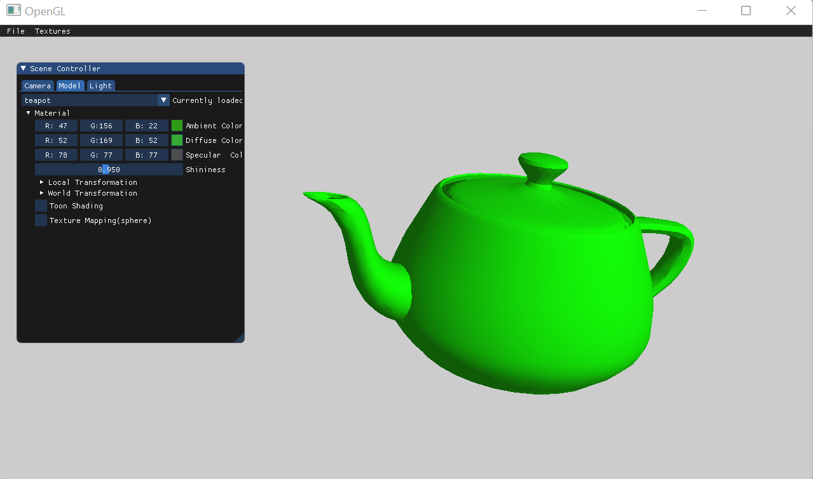
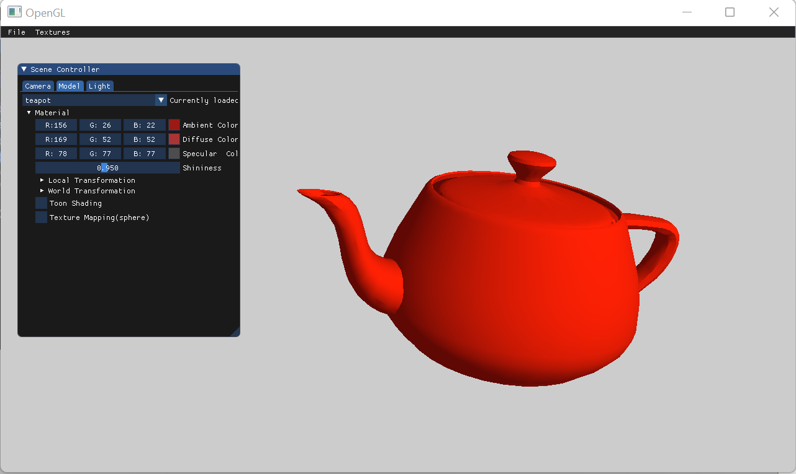
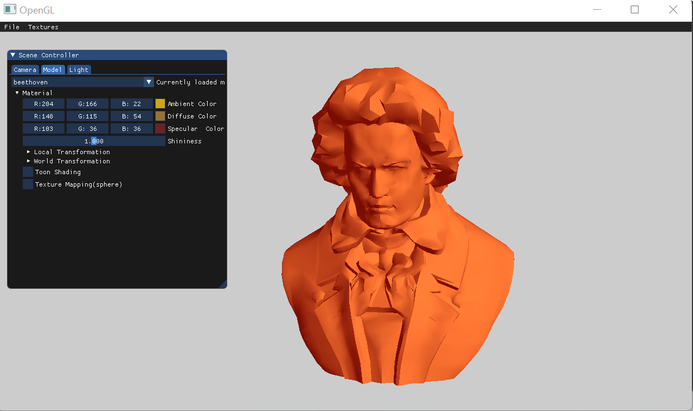
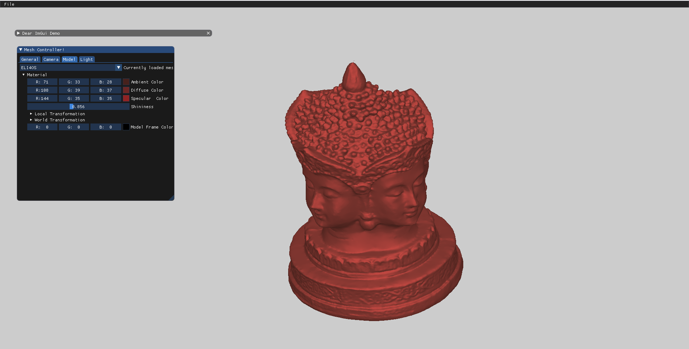

# Computer Graphics Project
This is a simple "Mesh Model Viewer" project that was developed using C++ and OpenGL during a Computer Graphics course at Haifa University.  
The course provided an introduction to the foundations of Computer Graphics, including math concepts, such as 2D and 3D transformations, shading models, and rendering techniques.  

## Building the Project
We used CMake for cross-platform builds.  
You can download it from: [https://cmake.org/download/](https://cmake.org/download/), but it is recommended to install it with a package manager instead.  
On Windows use [Chocolatey](https://chocolatey.org/install), and run in command line as administrator:  
```
choco install cmake.install
```
Debian/Ubuntu:
```
sudo apt-get install cmake
```
MacPorts on macOS:
```
sudo port install cmake.
```

## Some Demonstrations

### Materials

 
  
 


 
  

  
 

 

 



 
  


 
  



  

### Toon Shading
  
 

 
  
  
  
  

### Textures

  
    
  

  
    
  